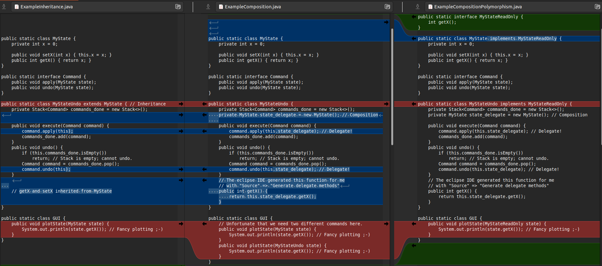

# Inheritance, Composition, Polymorphism

Initially I used to (ab)use inheritance often to foster code reuse in C++ and Java, but had noticed that this often leads to more trouble than it's worth. I understood more deeply why this is often not a good idea after writing my first program in Rust; a language without inheritance. 

Composition often leads to more modular and extensible code, at the cost of having to have delegate functions. A cost that is reduced substantially by automating their generation with IDEs such as Eclipse.  Finally, interfaces (Java) / pure virtual classes (C++) / traits (Rust) allow for polymorphism without inheritance. It's very unfortunate that Python does not have this as a built-in concept.

The three Java files in this repo illustrate these concepts. They do not require deep knowledge of Java, and should be legible for C++/Rust/Python coders.

## Use Case

Suppose there is some game that has a state, called `MyState`. This state can be plotted in a `GUI`. `MyState` provides the accessors `getX` and `setX`. The example has been kept minimal for legibility and didactical purposes; to understand the impact of the below on code reuse, imagine that each constructor/function is 100 lines of code (or more). (note that I've dropped the distracting  `static` keywords from the code in the below snippets)

```Java
class MyState {
    private int x = 0;
    public void setX(int x) { this.x = x; }
    public int getX() { return x; }
}
```

Later, a requirement is added to be able to undo changes to the state, and to log which player changed the state. The marketing department furthermore proposes to introduce special "magic" commands, which modify the state is a very specific way. On the other hand, a colleague developer needs `MyState` class elsewhere in the codebase, and is adament that its API is not changed. 

To meet these new requirements the [Command design pattern](https://refactoring.guru/design-patterns/command) is used, by providing the interface `Command`, and having specific commands implement it (including a "magic" command). The idea is that the state should only be changed by applying Commands to it, rather than using the `setX` method.

```Java
interface Command {
    public void apply(MyState state);
    public void undo(MyState state);
}
```

## Option 1: Inheritance

To have a state that can accept commands, a `MyStateUndo` class is implement, which inherits from `MyState`. The methods `apply(Command)` and `undo()` are implemented to meet the requirements.

```Java
class MyStateUndo extends MyState { // Inheritance
    private Stack<Command> commands_done = new Stack<>();

    public void execute(Command command) {
        command.apply(this);
        commands_done.add(command);
    }
    public void undo() {
        if (this.commands_done.isEmpty())
            return; // Stack is empty; cannot undo.
        Command command = commands_done.pop();
        command.undo(this);
    }
}
```

Now we can start playing the game! Below an example, where player1 and player2 provide a command. Strangely, `setX(int)` is called in between, leading for unclear semantics of the `undo()` command. In fact, `setX(int)` should really not be called on `MyStateUndo` at all, because the state change is not pushed on the stack of changes! 

```Java
    MyStateUndo state3 = new MyStateUndo();
    state3.execute(new CommandSet(3, "player1"));
    state3.execute(new CommandSet(6, "player2"));
    state3.setX(20); // Hey, who is this? Certainly not one of the players!
    state3.undo(); // What is the result now: weird to undo player2's move on the 20 above!!
```

The reason that we can call `setX(int)` is because `MyStateUndo` inherits it from `MyState`. This is not good. A workaround could be to override `setX(int)` in `MyStateUndo`, and make it throw an exception when it is called. But that would only lead to run-time errors. We would rather catch illegal calls to `setX(int)` during compile-time.

## Option 2a: Composition

An [alternative to inheritance is composition](https://en.wikipedia.org/wiki/Composition_over_inheritance). In this example, it is achieved by making `MyState` a member variable of `MyStateUndo` (i.e. `MyStateUndo` is *composed* of a `MyState` member, and possible other members).

```Java
class MyStateUndo {
    private Stack<Command> commands_done = new Stack<>();
    private MyState state_delegate = new MyState(); // Composition
    
    public void execute(Command command) {
        command.apply(this.state_delegate); // Delegate!
        commands_done.add(command);
    }
    public void undo() {
        if (this.commands_done.isEmpty())
            return; // Stack is empty; cannot undo.
        Command command = commands_done.pop();
        command.undo(this.state_delegate); // Delegate!
    }
    // The eclipse IDE generated this function for me 
    // with "Source" => "Generate delegate methods"
    public int getX() {
        return this.state_delegate.getX();
    }
}
```

Now we have the best of both worlds! We reuse the `getX` code in `MyState`, by delegating the `getX` call to the delegate member. And we cannot call `setX` on an `MyStateUndo` object, because it was not inherited from `MyState`.

There are some [downsides to this approach](https://en.wikipedia.org/wiki/Composition_over_inheritance#Drawbacks), one of them being the need to write delegator functions. Luckily, a good IDE will allow you to generate delegator functions for a member upon request. For instance, in Eclipse it is done with "Source" => "Generate delegate methods". If your IDE does not have an analogues feature, I think it's time to change IDE...

## Option 2b: Polymorphism Redeemed (that's a cool bandname!)

There has been an adverse side-effect when going from inheritance to composition. Before, the GUI class had only one function `plotState(MyState state)`. With composition, `MyStateUndo` is not longer a subclass of `MyState`, so we have to add a function `plotState(MyStateUndo state)` to the GUI class. This is annoying, and will quickly escalate throughout the code.

We can redeem polymorphism by introducing an interface `MyStateReadOnly`, which enforces implementation of the `getX()` function. The GUI now only has one function that takes an object that implements `MyStateReadOnly`. For this to work, both `MyState` and `MyStateUndo` must implement `MyStateReadOnly`. This is a trivial modification, because they already implemented the `getX()` function (otherwise we could not have plotted them in the GUI).

```Java
interface MyStateReadOnly {
    int getX();
}
```

As a side-remark, this is a general trick I have often used in Java, where I dearly miss the C++'s `const` annotator for functions and arguments. You have a class `MyClass` for which you make an interface `MyClassReadOnly` which only provides functions that do not modify the state of the object. You can now pass a `MyClass` object as a `MyClassReadOnly` to a function, and be 100% sure that it will not change its state. Again, IDE's should provide support for doing so. Eclipse has "Refactor" => "Extract Interface" for doing exactly this.


## Summary of differences between the three examples

The image below shows the differences between the codes are not that large. But the amount of bugs that can be avoided by using composition instead of inheritance for code reuse can save a lot of time!



## Personal perspective on the above wrt different languages

* Java
   * has the explicit `interface` keyword. Really helps with the correct implementation of many Design Patterns.
   * `const` for function arguments is missing, but can be emulated with a `ReadOnly` interface.
* C++
   * Allows for `pure virtual base classes`, but misses the explicit keyword for denoting them (to the best of my knowledge).
   * Has `const` keyword, which is great for enforcing contracts and catching bugs compile-time rather than run-time.
* Rust
   * Very strict: Only provides `interface`s (called `trait`s), and no inheritance.
   * Making constness explicit is enforced compile time.
* Python: 
   * Anything goes: no const, no interfaces, no in-built static typing, inheritance galore (another cool band name!). 
   * Pure virtual classes are available in principle with the [abc](https://blog.teclado.com/python-abc-abstract-base-classes/) module. [purepy](https://pypi.org/project/purepy/) more strictly implements pure virtual classes (i.e. "interfaces" in Java), but does not appear to have a large following.

